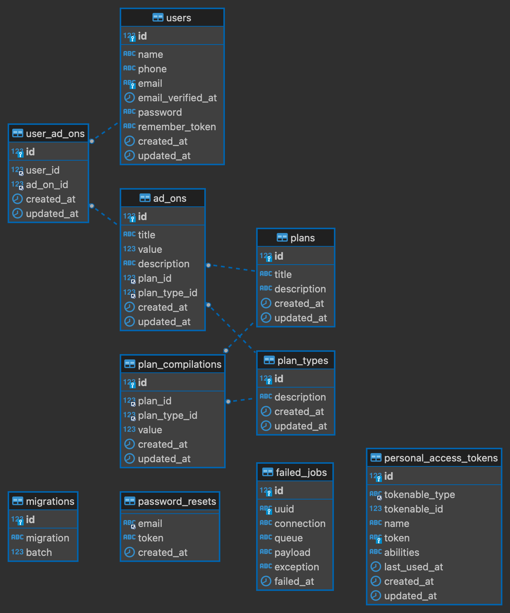

# API multi step form

This is an api to be used on the front of the challenge [Multi-step form challenge on Frontend Mentor](https://www.frontendmentor.io/challenges/multistep-form-YVAnSdqQBJ).

## Overview

### Database diagram


### Endpoints available

#### create user
```
POST /users
```
example body:
```
{
    "name": "teste",
    "email": "teste4@gmail.com",
    "phone": 63999999999,
    "ad_on_ids": [
        1, 2, 3
    ]
}
```
example response (success):
```
status code: 201
{
    "success": true,
    "msg": "user created"
}
```

example response (error):
```
status code: 422
{
    "message": "Validation errors",
    "data": {
        "email": [
            "The email has already been taken."
        ]
    }
}
```

#### list plans
```
GET /plans
```
example response:
```
{
    "data": [
        {
            "id": 1,
            "title": "Arcade",
            "description": "",
            "values": [
                {
                    "id": 1,
                    "plan_id": 1,
                    "plan_type_id": 1,
                    "value": 5,
                    "plan_type": {
                        "id": 1,
                        "description": "Monthly"
                    }
                }
            ]
        }
    ],
    "total": 1
}
```

#### list plan types

```
GET /plan-types
```
example response:
```
{
    "data": [
        {
            "id": 1,
            "description": "Monthly"
        }
    ],
    "total": 1
}
```

#### search ad ons

```
GET /ad-ons?id_plan=1&id_plan_type=2
```
example response:
```
{
    "data": [
        {
            "id": 1,
            "title": "Online service",
            "value": 1,
            "description": "Access to multiplayer games",
            "plan_id": 1,
            "plan_type_id": 1
        }
    ]
}
```

## My process

### Built with

- [Laravel](https://laravel.com/docs/11.x) - PHP framework
- [MySQL](https://www.mysql.com/products/community/) - Database

## Getting Started

first, install the dependencies:

```bash
composer install
```

copy the .env-example file and rename it to .env. in this file, configure your local database credentials

then, you will need to generate a key
```bash
php artisan key:generate
```

now run this command to create the tables in database
```bash
php artisan migrate
```

if you want populate database with some data you must need run
```bash
php artisan db:seed
```

well, now you just need to start the server running 
```bash
php artisan serve
```

everything is ok to make your requests by accessing [http://127.0.0.1:8000/api](http://127.0.0.1:8000/api)

